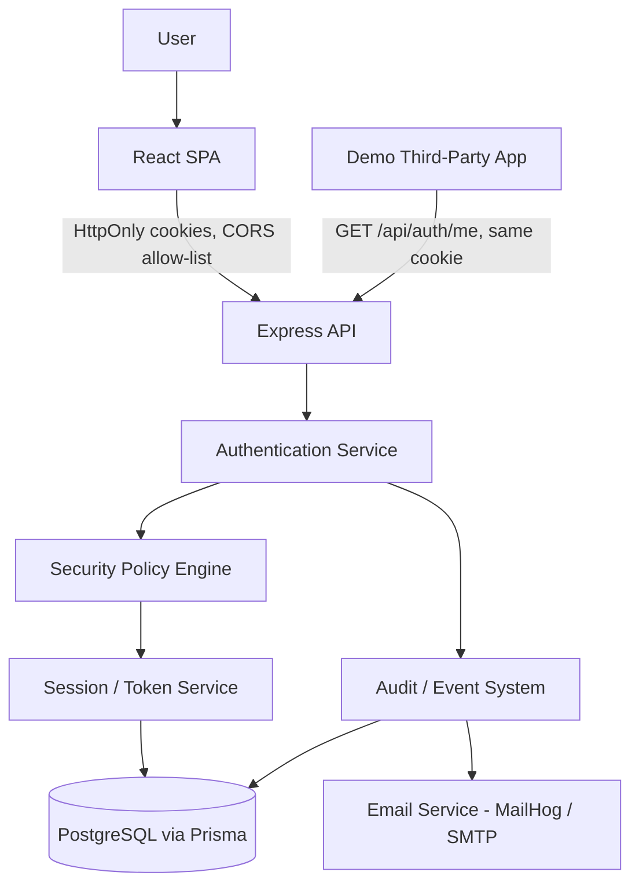
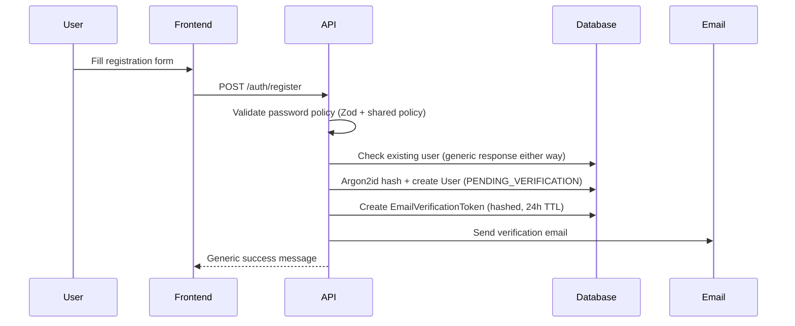
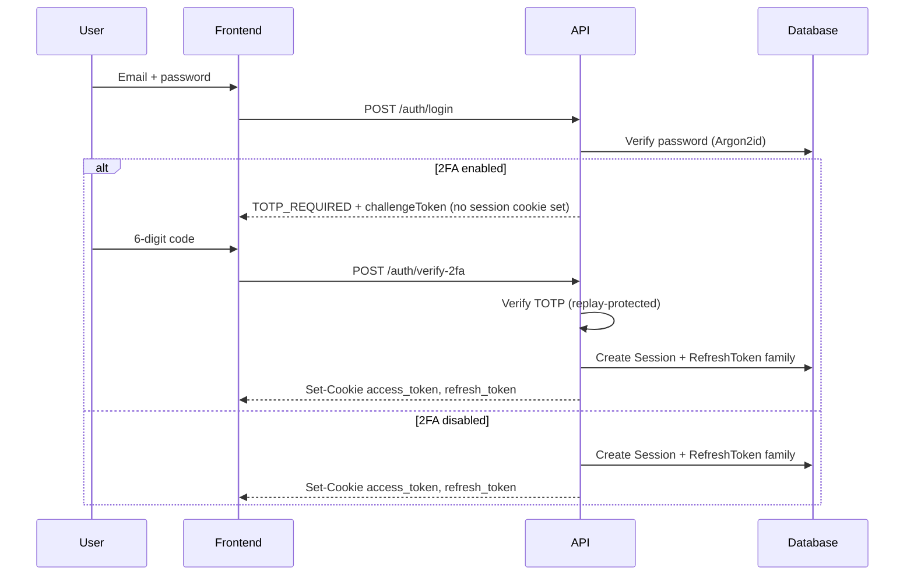
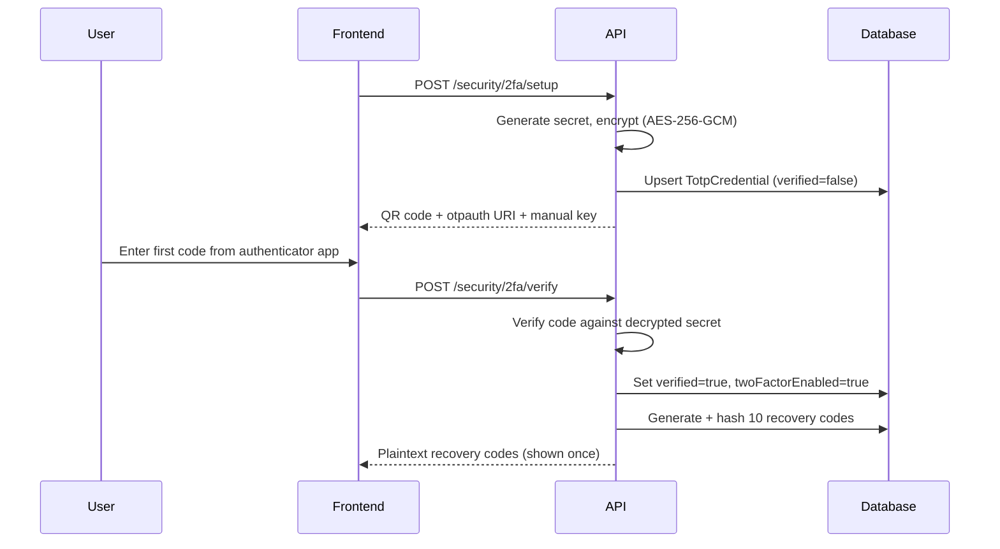
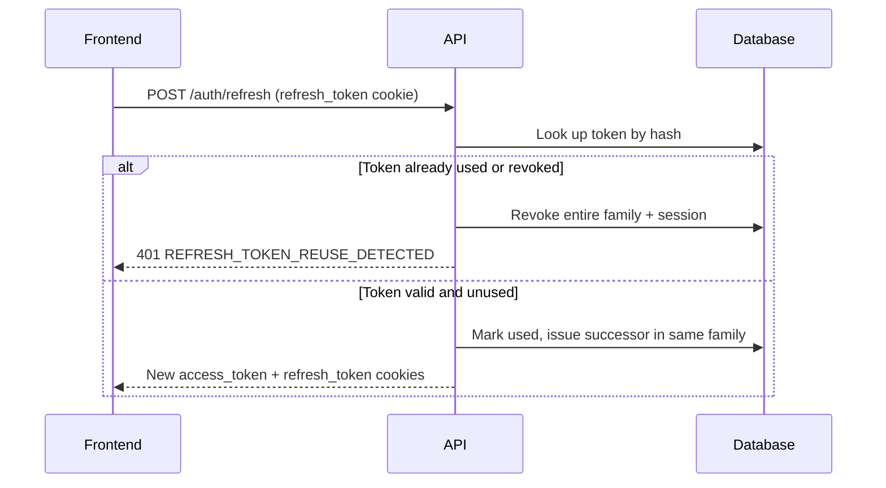
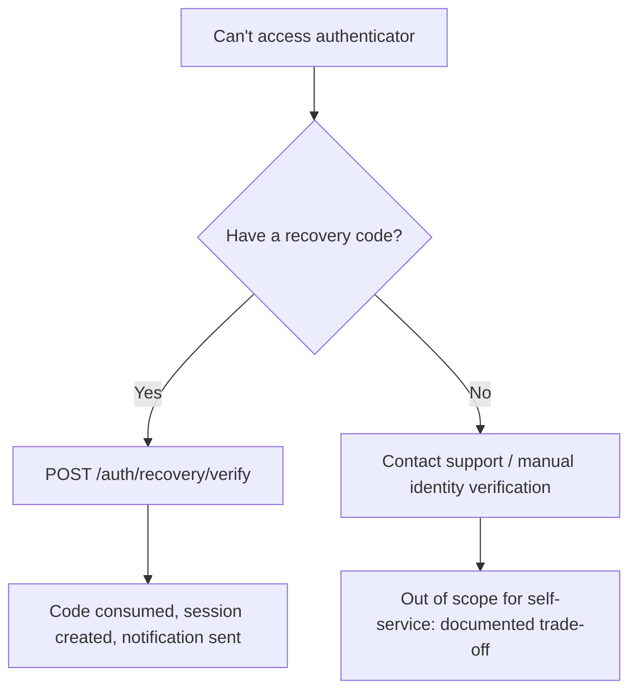

# Architecture Diagrams

## 1. System architecture

## 2. Registration flow

## 3. Login flow (with 2FA)

## 4. 2FA enrollment

## 5. Refresh-token rotation

## 6. Account recovery (lost authenticator)

